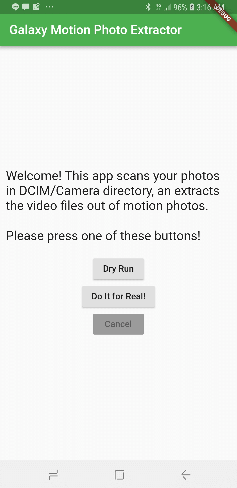
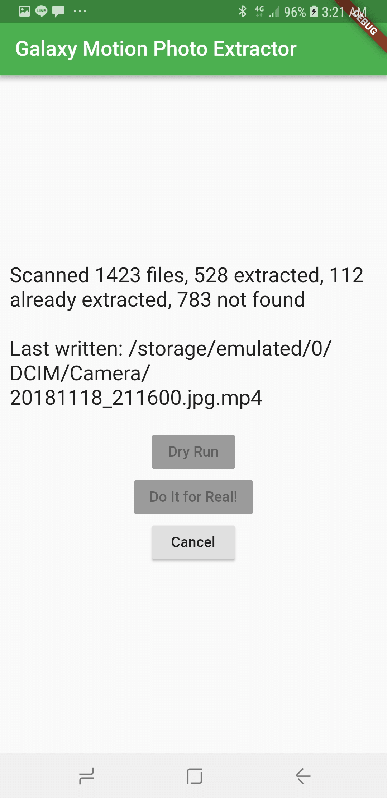
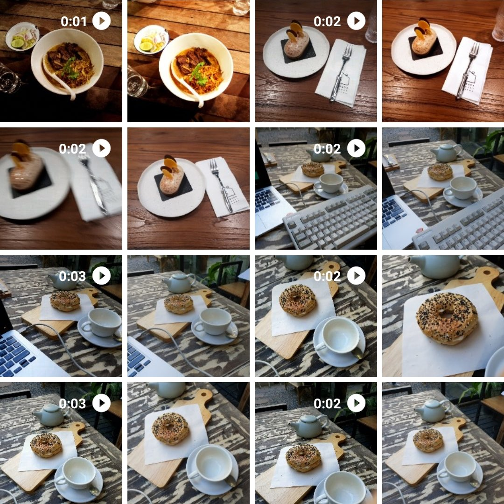

# Motion Photo Exploder for Galaxy

A Flutter Android app that extracts
[motion photos](https://www.samsung.com/global/galaxy/what-is/motion-photo/)
data out of the photos taken with Samsung Galaxy Camera into separate .mp4
files.

[**Now available on Play Store!**](https://play.google.com/store/apps/details?id=me.spacet.galaxymotionphotoextractor)

## Screenshots

<p align="center">
  
  
  
</p>

## Motivation

- Samsung Galaxy Camera app, since Galaxy S7, has a featured called **Motion
  Photos**: When you take a photo it will also save 2 seconds video before you
  press the shutter, an embed that video in the photo. This is similar to
  iPhone’s Live Photos, but without audio.

- I use Google Photos to backup all my photos. However, when backing up using
  the (free) high quality settings, **the motion photos are discarded.** That
  means if I use the “free up space” feature in Google Photos, my motion photos
  will be deleted forever. I don't want that.

- Searching around the internet, I found out that
  [“Samsung motion photos are simply a complete JPEG image followed by a 16-byte marker and then a complete MP4 video. The marker itself is `MotionPhoto_Data`.”](https://github.com/joemck/ExtractMotionPhotos#description-of-motion-photo-file-format).

- There are existing scripts that help do this, but they are for running on
  computers, and requires transferring the photos from the phone over to the
  computer to be able to extract it.

- Samsung’s Motion Photos are ~3 seconds of MP4 video at 12fps. So, instead of a
  single shot you get about 40.

- I want a solution that runs entirely on the phone.

## How to use

1. [Install Flutter](https://flutter.io/docs/get-started/install).

2. [Set up your environment for Flutter development](https://flutter.io/docs/get-started/editor?tab=vscode).

3. Clone this repository

4. `flutter run`

5. You see the initial screen with the instructions.

   - Press the **Dry Run** button to perform a dry run. This will scan all your
     photos and report what would happen but will not write the video file.

   - Press the **Do it for Real!** button to perform the batch video extraction
     process.

   - Press the **Cancel** button to abort the ongoing operation.

## Notes

- The app is hardcoded to process the `.jpg` files in
  `(internal storage)/DCIM/Camera`. It does not work with the SD card.

- This is my first ever app that’s written in Flutter. So the code may be very
  ugly, and the app may buggy. **Use it at your own risk. I am not responsible
  for any loss of data.**

## What’s with the name? Why "exploder"?

Because the apps main functionality can be accomplished using a single line of
PHP code, with the main ingredient being the function called
[explode()](http://php.net/explode).

```php
<?php
$path = '/path/to/image/file.jpg';
file_put_contents($path . '.mp4', explode('MotionPhoto_Data', file_get_contents($path))[1]);
```

## App description (for Google Play Store)

```
Please read before installing...

[Compatibility]
This app is intended for users of Samsung Galaxy phones that support Motion Photos feature. This includes Galaxy S9, S9+, Note8, S8, S8+, S7, and S7 edge.

[Main functionality]
Only 1 main feature is provided: It scans all the photos in `[Internal Storage]/DCIM/Camera/*.jpg`. If it finds an Motion Photo inside an image, it extracts the motion photo into a separate video file (.mp4).

[Use case]
I created this app because Google Photos does not keep motion photos when backing up using the free "High Resolution" setting. When I use Google Photo’s “Free Up Space” functionality, all motion photos is lost forever.

[Limitations]
- It only supports internal storage. SD card is not supported.
- It will extract all motion photos found in the camera. You cannot select which photo to extract or not extract.
- Important: Make sure your phone have enough available space! The app may write corrupt files if storage runs out.
- When taking a photo using the stock Camera app, make sure "Motion Photos" settings is enabled.
- Sometimes the app doesn't work. In that case, please try closing the app and opening it again.
- I do not take feature requests, but I provide the source code for anyone to modify it for their own needs.
- This app is provided as-is. Though I don't intend to cause any problem, I cannot guarantee the correctness of the app’s behavior. Please use at your own risk.

[Source code available]
I publish this app on the Play Store, in case other people who has the same problem may find it useful, but I do not plan to offer any support. However, this app is open source, and the code is available here: https://github.com/dtinth/galaxy_motion_photo_extractor
```

## Privacy policy

Everything happens on your phone. No photo gets sent anywhere by this app.

## Acknowledgements

Thanks
[@joemck for publishing the ExtractMotionPhotos project, which contains a _Description of Motion Photo File Format_](https://github.com/joemck/ExtractMotionPhotos#description-of-motion-photo-file-format)
and
[xda-developers user goofwear for having first published the initial file format description](https://forum.xda-developers.com/android/software/samsung-motion-photo-extractor-t3339997).
